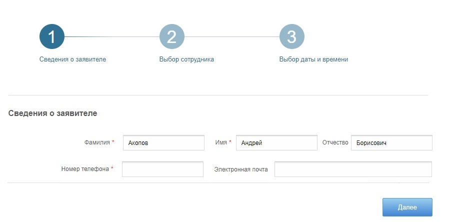
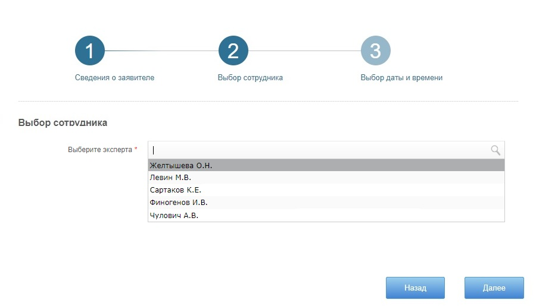
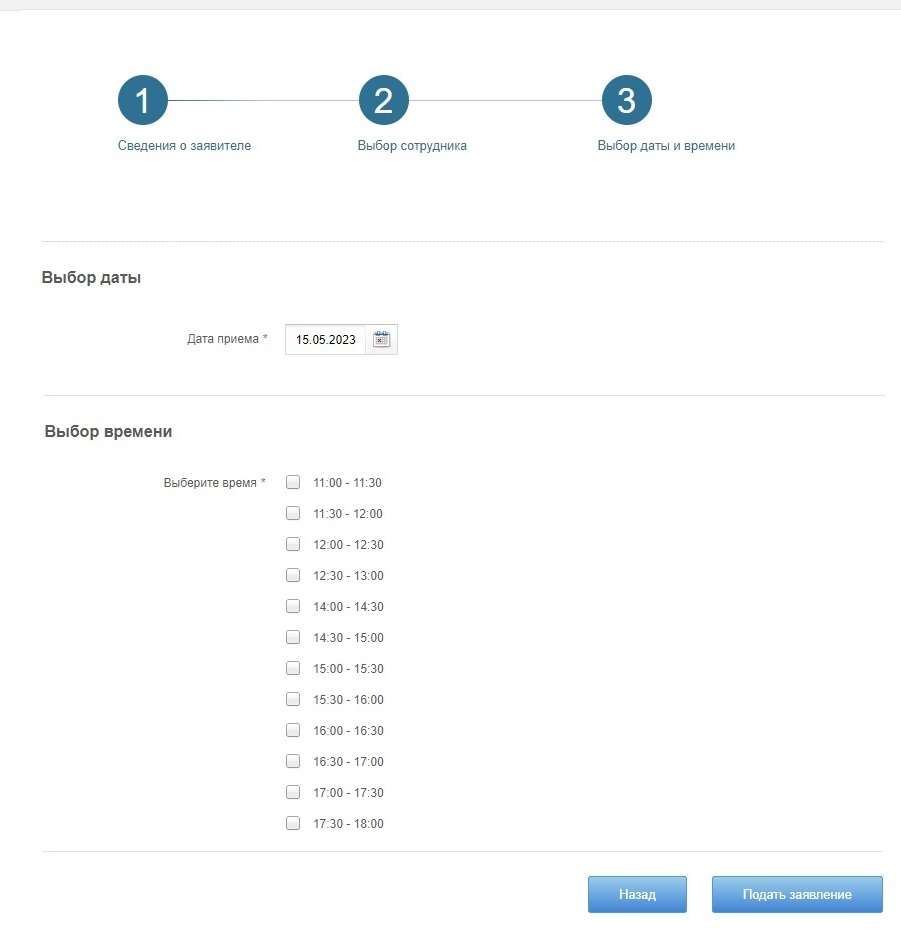

## Учебный проект курса [Otus](https://otus.ru) [Kotlin Backend Developer](https://otus.ru/lessons/kotlin/).
### Поток курса 2022-12.

BookingServise - это сервис записи на прием, с помощью которого индивидуальные предприниматели,
коммерческие и государственные предприятия смогут оптимизировать встречи посетителей и сотрудников. 
Сервис предназначен облегчить коммуникацию сотрудников организаций и посетителей. 
Людям не нужно звонить частному мастеру или в офис и общаться с живым человеком. 
Они заходят на сайт или переходят по ссылке, ищут нужного сотрудника, находят подходящую дату и время, жмут «Записаться» и готово. 
Сервис сам формирует расписание и показывает в календаре.

### Визуальная схема фронтенда

# Документация

1. Маркетинг
   1. [Описание MVP](./docs/01-marketing/01-description-mvp.md)
   2. [Заинтересанты](./docs/01-marketing/02-stakeholders.md)
   3. [Целевая аудитория](./docs/01-marketing/03-target-audience.md)
   4. [Конкурентный анализ](./docs/01-marketing/04-concurrency.md)
   5. [Планы на развитие](./docs/01-marketing/05-development-plans.md)
   6. [Пользовательские истории](./docs/01-marketing/06-user-stories.md)
2. DevOps    
   1. [Схема инфраструктуры](./docs/02-devops/01-infrastruture.md)
   2. [Схема мониторинга](./docs/02-devops/02-monitoring.md)
3. Тесты
4. Архитектура
   1. [Компонентная схема](./docs/04-architecture/01-architecture.md)
   2. [Интеграционная схема](./docs/04-architecture/02-integration.md)
   3. [Описание API](./docs/04-architecture/03-api.md)
   4. [Модель данных](./docs/04-architecture/04-data-model.md)